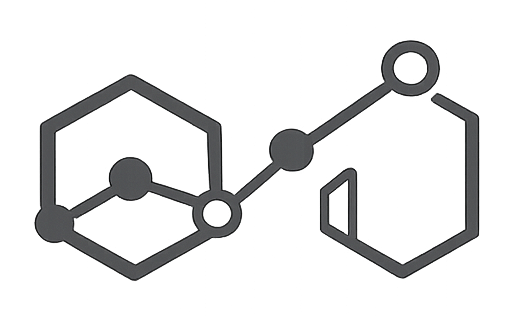

# Auditoría UX/UI y SEO — Synapsis Health
## Parte 03: Accesibilidad WCAG 2.1 (PRIORIDAD ALTA)

**Fecha original:** 2026-02-14
**Última actualización:** 2026-03-27

---

## 9. HTML SEMÁNTICO

### 9.1 Uso de tags semánticos

**Estado:** ✅ CORRECTO

| Tag | index.html | equipo.html | servicios.html | articulos.html |
|---|---|---|---|---|
| `<nav>` | ✅ (navbar + footer) | ✅ | ✅ | ✅ |
| `<main>` | ✅ `id="main-content"` | ✅ | ✅ | ✅ |
| `<footer>` | ✅ | ✅ | ✅ | ✅ |
| `<section>` | ✅ (10 secciones) | ✅ | ✅ | ✅ |
| `<aside>` | N/A | N/A | ✅ (sidebar) | N/A |
| `<header>` | ❌ Ausente | ❌ Ausente | ❌ Ausente | ❌ Ausente |
| `<article>` | N/A | N/A | N/A | ✅ (posts) |

**Hallazgo:** No se usa `<header>` para envolver el `<nav>`. Es una mejora semántica menor.

**Impacto:** Bajo — La estructura actual es funcional sin `<header>`.

---

### 9.2 Estructura lógica del documento

**Estado:** ✅ CORRECTO — skip-link → nav → main (sections) → footer en todas las páginas.

---

### 9.3 `<button>` vs `<a>` correctamente

**Estado:** ✅ CORRECTO

- `<button>` para acciones: toggle menú, cambio idioma, tabs ✅
- `<a>` para navegación: links entre páginas y secciones ✅
- CTAs con `<a class="btn-primary">` son navegación, no acciones ✅

---

### 9.4 Listas

**Estado:** ✅ CORRECTO — `<ul>/<li>` donde corresponde.

---

### 9.5 Tablas

**Estado:** ✅ N/A — No hay tablas en el sitio.

---

### 9.6 Uso incorrecto de `<div>`

**Estado:** ⚠️ ADVERTENCIA MENOR (sin cambios)

Algunas listas de ítems usan `<div>` en grid donde `<ul>/<li>` sería más semántico (ej: sección ética en index.html).

---

## 10. ARIA Y ACCESIBILIDAD

### 10.1 ARIA labels en iconos sin texto

**Estado:** ✅ CORRECTO

- Todos los SVGs decorativos: `aria-hidden="true"` ✅
- Botones icon-only: `aria-label` descriptivo ✅
  - `aria-label="Abrir menú"` ✅
  - `aria-label="Cerrar menú"` ✅
  - `aria-label="Cambiar idioma"` ✅
  - `aria-label="Contactar por WhatsApp"` ✅

---

### 10.2 Role attributes

**Estado:** ✅ CORRECTO

| Elemento | Role | Estado |
|---|---|---|
| Mobile menu | `role="dialog"` | ✅ |
| Tab list (servicios/equipo) | `role="tablist"` | ✅ |
| Tab buttons | `role="tab"` con `aria-selected` | ✅ |
| Tab panels | `role="tabpanel"` | ✅ |
| Error messages | `role="alert"` | ✅ |
| Success message | `role="status"` | ✅ |
| Form feedback | `role="alert"` + `aria-live="assertive"` | ✅ |

---

### 10.3 aria-hidden en elementos decorativos

**Estado:** ✅ CORRECTO — Todos los SVGs decorativos, logos, y bullets tienen `aria-hidden="true"`.

⚠️ **Excepción:** `index.html:163` — Logo decorativo grande en hero no tiene `aria-hidden`:
```html

```
Debería tener `aria-hidden="true"` ya que es puramente decorativo.

---

### 10.4 aria-label/aria-labelledby en form inputs

**Estado:** ✅ CORRECTO — Todos los inputs tienen `<label>` con `for/id` matching Y `aria-describedby` para errores.

---

### 10.5 aria-live para contenido dinámico

**Estado:** ✅ CORRECTO (corregido desde última auditoría)

```html
<!-- index.html:797 — aria-live implementado -->
<div id="form-feedback" class="hidden" aria-live="assertive" role="alert"></div>
<div id="form-success" class="success-message" role="status" aria-live="polite">
```

---

### 10.6 ARIA innecesario

**Estado:** ✅ CORRECTO — No hay ARIA redundante.

---

### 10.7 Landmarks ARIA

**Estado:** ✅ CORRECTO — Navegación principal y footer con `aria-label` diferenciados.

---

## 11. FORMULARIOS ACCESIBLES

### 11.1 Labels asociados a inputs

**Estado:** ✅ CORRECTO

| Input | Label | for/id match |
|---|---|---|
| nombre | "Nombre *" | ✅ |
| email | "Email *" | ✅ |
| telefono | "Celular *" | ✅ |
| organizacion | "Organización" | ✅ |
| mensaje | "Mensaje *" | ✅ |

---

### 11.2 Placeholders NO reemplazan labels

**Estado:** ✅ CORRECTO — Labels visibles + placeholders adicionales.

---

### 11.3 Atributos required, type

**Estado:** ✅ CORRECTO

| Input | type | required | minlength | maxlength |
|---|---|---|---|---|
| nombre | text | ✅ | 2 | 100 |
| email | email | ✅ | — | — |
| telefono | tel | ✅ | — | 30 |
| organizacion | text | — | — | 150 |
| mensaje | textarea | ✅ | 10 | 1000 |

---

### 11.4 Autocomplete attributes

**Estado:** ✅ CORRECTO — `name`, `email`, `tel`, `organization` implementados.

---

### 11.5 Mensajes de error con role="alert"

**Estado:** ✅ CORRECTO (corregido desde última auditoría)

Los `<span>` de error tienen `role="alert"` y el JS (`setFieldError`) los popula correctamente:
```javascript
function setFieldError(fieldId, msg) {
  const input = document.getElementById(fieldId);
  const error = document.getElementById(fieldId + "-error");
  if (input) input.setAttribute("aria-invalid", "true");
  if (error) error.textContent = msg;
}
```

---

### 11.6 aria-invalid en campos con error

**Estado:** ✅ CORRECTO (corregido desde última auditoría)

El JS implementa `aria-invalid="true"` cuando hay error via `setFieldError()`.

---

### 11.7 aria-describedby para help text

**Estado:** ✅ CORRECTO — Campos obligatorios vinculados a sus spans de error.

---

### 11.8 fieldset/legend en grupos de inputs

**Estado:** ⚠️ ADVERTENCIA (sin cambios)

No usa `<fieldset>/<legend>`. Aceptable para formulario simple.

---

## 12. NAVEGACIÓN POR TECLADO

### 12.1 Tabindex apropiado

**Estado:** ✅ CORRECTO — Solo `tabindex="-1"` en honeypot (correcto).

---

### 12.2 Skip links

**Estado:** ✅ CORRECTO — Presente en todas las páginas con CSS que lo muestra al focus.

---

### 12.3 Focus visible

**Estado:** ✅ CORRECTO

```css
*:focus-visible {
  outline: 2px solid #2D2D2D;
  outline-offset: 2px;
}
```

Botones con `focus:ring-2 focus:ring-graphite-400 focus:ring-offset-2` ✅
Form inputs con `focus:border-graphite-400 focus:ring-2 focus:ring-graphite-200` ✅

---

### 12.4 Elementos clickeables sin acceso por teclado

**Estado:** ✅ CORRECTO — Todos los elementos interactivos son `<a>` o `<button>` nativos.

---

### 12.5 Orden lógico de tab navigation

**Estado:** ✅ CORRECTO — DOM order = visual order.

---

### 12.6 Modals trapean focus

**Estado:** ✅ CORRECTO (corregido desde última auditoría)

Focus trap implementado en `main.js`:
```javascript
const trapFocus = (e) => {
  if (e.key !== "Tab") return;
  const focusable = menu.querySelectorAll(focusableSelector);
  // ... trap logic
};
const open = () => {
  // ...
  close?.focus();  // Focus al botón de cierre
  menu.addEventListener("keydown", trapFocus);
};
const shut = () => {
  // ...
  menu.removeEventListener("keydown", trapFocus);
  toggle.focus();  // Devuelve focus al toggle
};
```

---

### 12.7 ESC cierra modals/dropdowns

**Estado:** ✅ CORRECTO (corregido desde última auditoría)

```javascript
document.addEventListener("keydown", e => {
  if (e.key === "Escape" && !menu.classList.contains("translate-x-full")) shut();
});
```

---

## 13. CONTRASTE Y VISUALIZACIÓN

### 13.1-13.3 Contraste de colores

**Estado:** ⚠️ ADVERTENCIA (sin cambios significativos)

**Sobre fondo claro #FAFAFA:**

| Uso | Color | Hex | Ratio vs #FAFAFA | WCAG AA (4.5:1) |
|---|---|---|---|---|
| Texto principal | graphite-800 | #2D2D2D | 11.5:1 | ✅ |
| Body text | graphite-500 | #5C5C5C | 5.7:1 | ✅ |
| Muted text | graphite-400 | #7A7A7A | 3.8:1 | ❌ (texto normal) / ✅ (grande) |
| Placeholders | graphite-300 | #9A9A9A | 2.6:1 | ❌ |

**Sobre fondo oscuro #111111 (footer):**

| Uso | Color | Hex | Ratio vs #111111 | WCAG AA |
|---|---|---|---|---|
| White text | white | #FFFFFF | 18.1:1 | ✅ |
| Footer text/links | graphite-400 | #7A7A7A | 3.2:1 | ❌ (normal) / ✅ (large) |
| Copyright | graphite-400 | #7A7A7A | 3.2:1 | ❌ |

**Problemas de contraste que persisten:**

1. **Footer links** (graphite-400 sobre graphite-950): Ratio ~3.2:1 — ❌ Falla AA para texto normal
   - **Recomendación:** Cambiar a `text-graphite-300` (#9A9A9A, ratio 4.8:1)

2. **Placeholders** (graphite-300 sobre white): Ratio 2.6:1 — ❌
   - **Nota:** WCAG no exige contraste en placeholders pero lo recomienda

**Impacto:** Medio — El footer tiene texto con contraste insuficiente para WCAG AA.

---

### 13.4 Color como único indicador

**Estado:** ✅ CORRECTO — Diferencias de peso visual, fondo, y texto complementan los cambios de color.

---

### 13.5 Tamaños de fuente mínimos

**Estado:** ✅ CORRECTO — Base 16px. El más pequeño es `text-xs` (12px) para labels/footer.

---

### 13.6 Line-height

**Estado:** ✅ CORRECTO — `leading-relaxed` (1.625) en body text. Supera mínimo 1.5.

---

## RESUMEN ACCESIBILIDAD WCAG 2.1 (actualizado 2026-03-27)

| Ítem | Estado anterior (02/14) | Estado actual (03/27) | Impacto |
|---|---|---|---|
| Tags semánticos | ✅ (falta header) | ✅ (sin cambio) | Bajo |
| Estructura lógica | ✅ | ✅ | — |
| button vs a | ✅ | ✅ | — |
| Listas | ✅ | ✅ | — |
| ARIA labels iconos | ✅ | ✅ | — |
| Roles | ✅ | ✅ | — |
| aria-hidden decorativos | ✅ | ✅ (1 excepción menor) | Bajo |
| Form labels | ✅ | ✅ | — |
| aria-live form feedback | ⚠️ Parcial | ✅ **Corregido** | — |
| Placeholders vs labels | ✅ | ✅ | — |
| Autocomplete | ✅ | ✅ | — |
| Error role="alert" + JS | ⚠️ No populados | ✅ **Corregido** (setFieldError) | — |
| aria-invalid | ❌ Ausente | ✅ **Corregido** | — |
| Skip links | ✅ | ✅ | — |
| Focus visible | ✅ | ✅ | — |
| Keyboard access | ✅ | ✅ | — |
| Focus trap en modal | ❌ Ausente | ✅ **Corregido** | — |
| ESC cierra modal | ❌ Ausente | ✅ **Corregido** | — |
| Contraste footer | ⚠️ | ⚠️ **Sin cambio** | Medio |
| Contraste placeholders | ⚠️ | ⚠️ **Sin cambio** | Bajo |
| Color como indicador | ✅ | ✅ | — |
| Font sizes | ✅ | ✅ | — |
| Line-height | ✅ | ✅ | — |

**Errores Críticos:** 0 (todos los críticos anteriores fueron corregidos)
**Advertencias:** 2 (contraste footer, contraste placeholders)
**Correctos:** 20
**Corregidos desde última auditoría:** 5 (focus trap, ESC modal, aria-invalid, aria-live, error messages JS)
